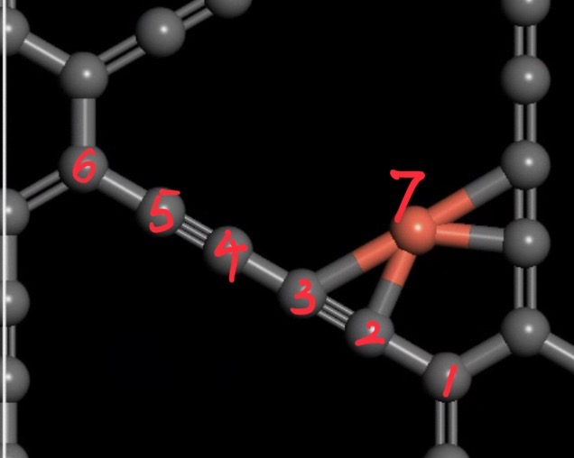

# Generation of adsorption models for CO2RR C2 pathway

(ACS Catal. 2018, 8, 2, 1490,1499)

There are two major pathways: ethylene and ethanol, and several side products
along these two pathways. The adsorbates will be corresponded to the number in
this figure.

## Metal elements in the GDY model

1. 3d, 10 elements
2. 4d, 10 elements
3. 5d (without rare-metals) 9 elements
4. Lm rare-metals, 15 elements

10 + 10 + 9 + 15 = 44 in total.

## Candidate coordination sites on GDY-M model

Name given in generated files:
1. NR (nearer ring carbon)
2. C1
3. C2
4. C3
5. C4
6. FR (far ring carbon)
7. M (metal site)

When adsorbate is doubly coordinated, the choices of adsorption sites are:
1. C1-M
2. C2-M
3. C1-C2
4. C2-C3
5. C3-C4
6. C4-FR
7. C1-NR

When the adsorbate is symmetric, there is 7 combinations for each.
When the adsorbate is asymmetric, the molecule will be turned 180 degrees for
the above sites, leading to a total of 14 combinations for each.

## Organizations of generated models

Pathways:
1. ethylene
2. acetic_acid
3. ethanol
4. ethanol_other

### ethylene

1. CO (1): single, 7 for each
2. CHO (2): single, 7 for each
3. COCHO (3): single,  7 for each
4. COCHOH (4a): single, 7 for each
5. OCH2CO (5a): double asymmetric, 14
6. OCH2COH (6a): double asymmetric, 14
7. OCH2CHOH (7a): double asymmetric, 14
8. OCH2CH (8a): double asymmetric, 14
9. OCH2CH2 (9a): double asymmetric, 14
10. C2H4: double symmetric, 7

## acetic_acid

Derived from 6a

1. OCH2C_cyc_OH (7c): single, 7
2. CH3COOH: single, 7

## ethanol
1. Glyoxal (4b): double asymmetric, 14
2. HOCCHO (5b): double symmetric, 7
3. HOHCCHO (6b): double asymmetric, 14
4. Glycolaldehyde (7b as well): double asymmetric, 14
5. CH2CHO (8b): single, 7
6. CH2CHOH (9b): double asymmetric, 14
7. CH2CH2OH (10b): single, 7
8. acetaldehyde: single, 7
9. CH3CH2OH : single, 7

## ethanol_other

1. CH2OHCH2O (8d): double asymmetric, 14
2. ethylene_glycol: double symmetric, 7
